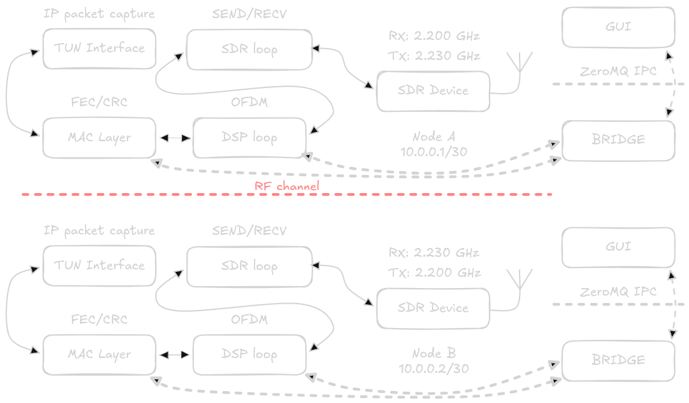

# SDR Wireless Tunnel

[](https://isocpp.org/)
[](#phy-parameters)

[](https://cmake.org/)
[](https://opensource.org/licenses/MIT)

> Experimental point-to-point IP tunnel over the air using Software Defined Radio and OFDM.  
> Research/learning project - not production software.

---

## What is this?

A proof-of-concept that turns a pair of SDR devices into a wireless IP tunnel.
The system reads IP packets from a Linux TUN interface, modulates them using OFDM,
transmits over the air, and reconstructs the original packets on the receiving end -
effectively creating a custom Layer 3 radio link from scratch.

The PHY layer is broadly inspired by LTE's narrowband profile:
**1.4 MHz bandwidth, 128 OFDM subcarriers**. The link operates in FDD mode with 3 MHz duplex spacing at 2.2 GHz.

---

## Architecture

<p align="center">
  
</p>

Six threads share a common data structure and communicate via lock-free queues:

| Thread           | Role                                                   |
| ---------------- | ------------------------------------------------------ |
| `tun_tx_thread`  | Reads/Injects IP packets from the TUN device           |
| `dsp_tx_thread`  | OFDM modulation -> baseband IQ samples                 |
| `sdr_thread`     | SoapySDR hardware interface - simultaneous RX/TX       |
| `dsp_rx_thread`  | Synchronization, channel estimation, OFDM demodulation |
| `dsp_gui_bridge` | Forwards DSP metrics to GUI over ZeroMQ                |
| `ip_gui_bridge`  | Forwards IP-layer statistics to GUI over ZeroMQ        |

The bridge threads use ZeroMQ sockets so the GUI is **completely optional** -
the core tunnel runs headless, and the GUI can be attached or detached independently.

---

## PHY Parameters

| Parameter           | Value                               |
| ------------------- | ----------------------------------- |
| Waveform            | OFDM                                |
| Bandwidth           | 1.4 MHz                             |
| Subcarriers         | 128                                 |
| RB (Resource Block) | 6 (72 active subcarriers)           |
| Pilots              | 6                                   |
| Sample rate         | 1.92 MSPS                           |
| FDD spacing         | 3 MHz                               |
| Duplex mode         | FDD (Frequency Division Duplex)     |
| Profile             | LTE-inspired (narrowband)           |
| Hardware API        | SoapySDR (RTL-SDR, HackRF, USRP, …) |

---

## Stack

| Layer            | Library                    |
| ---------------- | -------------------------- |
| Language         | C++20                      |
| SDR hardware     | SoapySDR                   |
| Network tunnel   | Linux TUN (`/dev/net/tun`) |
| IPC / GUI bridge | ZeroMQ                     |
| GUI              | Dear ImGui + ImPlot        |
| Logging          | spdlog                     |
| CLI options      | cxxopts (header-only)      |

---

## Building

```bash
# Dependencies Ubuntu / Debian
sudo apt install \
  libfftw3-dev \
  libsdl2-dev \
  libglew-dev \
  libsoapysdr-dev \
  libopengl-dev \
  cmake \
  build-essential

# Clone & build
git clone https://github.com/DSR3164/sdr-ofdm-ip-protocol
cd sdr-ofdm-ip-protocol
cmake -B build -DCMAKE_BUILD_TYPE=Release
cd build
cmake --build . -j$(nproc)
```

---

## Configuration

```bash
sudo ./soip --help
```

```
Software Defined Radio application
Usage:
  soip [OPTION...]

  -c, --config arg              Path to config file (default:
                                ../config/sdr.conf)
  -m, --modulation arg          Modulation scheme (BPSK, QPSK, QAM16,
                                QAM64) (default: QAM64)
  -n, --node arg                Base Node settings (A / B)
  -r, --rx [=arg(=2200000000)]  Set RX frequency (Hz)
  -t, --tx [=arg(=2230000000)]  Set TX frequency (Hz)
  -i, --ip arg                  Set IP Adress (default: 10.0.0.2)
      --log-level arg           Log level for all
                                (trace/debug/info/warn/error/critical)
                                (default: info)
      --log-sdr arg             Log level for SDR
      --log-tun arg             Log level for TUN
      --log-gui arg             Log level for GUI
      --log-dsp arg             Log level for DSP
      --log-main arg            Log level for MAIN
      --log-socket arg          Log level for SOCKET
  -h, --help                    Print usage
```

The application operates as a point-to-point FDD link over a `/30` subnet. Each end of the link runs a separate node role:

| Node | IP       | RX Carrier | TX Carrier |
| ---- | -------- | ---------- | ---------- |
| A    | 10.0.0.1 | 2.20 GHz   | 2.23 GHz   |
| B    | 10.0.0.2 | 2.23 GHz   | 2.20 GHz   |

### Example

Node A:

```bash
sudo ./soip --node A --modulation QAM64
```

Node B:

```bash
sudo ./soip --node B --modulation QAM64
```

---

## Running

**Headless (no GUI required):**

```bash
sudo ./soip -n A -m QAM64
```

**With GUI (separate process, attaches over ZeroMQ):**

```bash
sudo ./gui &
sudo ./soip -n A -m QAM64
```

> GUI and core can be started in any order.

> Both ends must run the same build against compatible hardware.

---

## GUI

The GUI is optional and attaches to the core process over ZeroMQ.

**PHY / DSP view:**

- Constellation diagram - received symbols after full DSP pipeline:
  `coarse CP sync -> coarse CFO -> ZC sync -> fine CFO -> equalization`
- Time-domain raw signal

**IP / MAC view:**

- Raw byte plot of the last received IP packet
- MAC header: Magic, Packet Length, Sequence Number, Flags, Reserved
- IP header: Version, Header Length, TOS, Total Length, Protocol, Source IP, Destination IP

---

## Status & Goals

This is an **experiment**, not a finished product. Current areas of interest:

- [ ] Adaptive MCS (modulation & coding scheme)
- [ ] LDPC / turbo FEC
- [ ] Time & frequency synchronization robustness
- [ ] Throughput benchmarks vs. distance

Contributions, ideas, and results from your own hardware setups are very welcome.

---

## License

MIT © 2026 Excalibur

<div align="center">
  <sub>Built with a custom spectrum analyzer, questionable sleep schedule, and an unreasonable amount of coffee ☕</sub>
</div>
